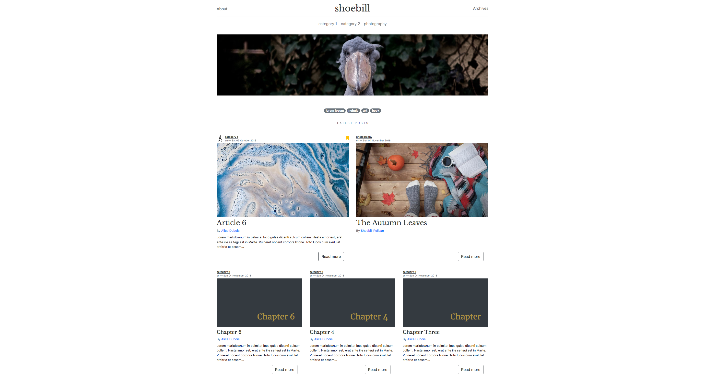

# Template Static Website

This is a template website using [Pelican](http://docs.getpelican.com/en/stable/index.html). You can get it working, make it your own and publish it in less than an hour.

Main features are:

* Articles on a category page can either be displayed with a grid or a list
* Drafts are password protected
* possibility to display pinned articles in the category pages and a unique banner article in the home page
* photo album automatically processed for the web, via the pelican photos plugin

See the demo [here](https://otso-andersen.github.io/shoebill-template-pelican/).  
To test a password protected page, go to [this encrypted article](https://otso-andersen.github.io/shoebill-template-pelican/drafts/protected-one_encrypted.html) and enter the password `1234`.



## I) How to install

Here's how to install and run it on your own:

### 1. Copy this repository (git clone source code)

First, choose a name for your project, create an appropriately-named directory for your site, and switch to that directory

```bash
mkdir -p ~/path_to_my_folder
cd ~/path_to_my_folder
git clone https://github.com/otso-andersen/shoebill-template-pelican.git
```

### 2. Virtual environment

```bash
sudo pip install virtualenv

```

Then

```bash
virtualenv .
source bin/activate
```

### 3. Install the requirements (Pelican, Markdown and plugins requirements)

```bash
pip install -r requirements.txt
```

### 4. Generate the site

From your site directory, run the `pelican` command to generate your site:

```bash
pelican content
```

This create a folder `output` with the generated website.

Alternatively, you can use the `make` command:

```bashrc
make html
```

### 5. Preview your site

Open a new terminal session and run the following commands to switch to your output directory and launch Pelican’s web server:

```bash
cd ~/path_to_my_folder/website/output
python -m pelican.server

```

Preview your site by navigating to http://localhost:8000/ in your browser.

If you’d prefer to have Pelican automatically regenerate your site every time a change is detected (which is handy when testing locally), the best way is to use the following `make` command instead:

```bashrc
make devserver
```

The above command will simultaneously run Pelican in regeneration mode as well as serve the output at http://localhost:8000. Once you are done testing your changes, you should stop the development server via (after `ctrl+C`):

```bashrc
make serverstop
```

## II) How to write content

### 1. Write an article

Use your preferred text editor to create your first article with the following content:

```markdown
Title: My article title

This is the content of my article
```

This is as simple as that! Given that this example article is in Markdown format, save it as `~/path_to_my_folder/website/content/myarticle.md`.  
You can learn how to write in Mardown in 5 min, for example [here](https://en.wikipedia.org/wiki/Markdown#Example).

`Title` is the only required metadata. Other options can be passed:

List of metadata recognized by this theme:  

* Title
* Status: draft / published
* SubTitle
* Tags: tag 1, tag 2
* Image: picture for the thumbnail and the cover
* Summary
* Authors: Author 1, Author 2, Author 3
* Lang: fr (language of the article, default to english)
* Date: yyyy-mm-dd (date of creation)
* Modified: yyyy-mm-dd (date of modification)
* Gallery: {photo}folder (add the gallery with the photos inside folder)
* Pin: true (pin the article on the homepage -- multiple pinned articles possible)
* Cooking_time: 50 min (indicate the time for a cooking recipe)
* Banner: true (make this the first big article on the homepage -- only one possible)
* Toc_hidden: true (hide the table of content)
* Cover: true (use the picture in the metadata Image as a cover on the article page)

For more information on how to write content see the [Pelican documentation](http://docs.getpelican.com/en/stable/content.html).

### 2. Difference between articles and pages

Pelican considers “articles” to be chronological content, such as posts on a blog, and thus associated with a date.

The idea behind “pages” is that they are usually not temporal in nature and are used for content that does not change very often (e.g., “About” or “Contact” pages).

Write your pages inside the folder `content/pages`.  
Write your articles inside the folder `content/category_name`, where `category_name` is the name of your article category. This will automatically generate the category of your article (you don't have to write `Category: My Category`inside the file).  

### 3. How to include images

If you want to include images, put them inside a folder `content/pictures` or inside `content/pictures/category_name` if you want to arrange your folder by category (or wherever you want really, as long as you link to the correct folder `PHOTO_LIBRARY` in `pelicanconf.py`).  

To add your image to your article, link to it where you want it to appear inside the markdown file:

```markdown

```

### 4. Drafts

Drafts are article with the metadata `Status: draft`.
Your drafts will all be password protected and can be accessed via the URL `SITEURL/drafts/name_encrypted.html`. This uses [Staticrypt](https://www.npmjs.com/package/staticrypt).

Change the password inside the Makefile:

```bash
PASSWORD = 1234
```

## III) Customize the settings

### 1. pelicanconf.py

* Change the name of your website, the author and the quote on the home page:

```python
AUTHOR = u'John Smith'
SITENAME = u'name'
SITEURL = ''
```

* If you want your article to have `Status: draft`by default (instead of being published), add this line of code inside pelicanconf.py:

```python
# By default, new articles will be drafts. To publish them, add [Status: published] to its .md
DEFAULT_METADATA = {
    'status': 'draft',
}
```

### Special Theme settings:

* Display author names (on the thumbnails of posts and at the end of each article):

`DISPLAY_AUTHORS = True`

* Location of the folder containing your images for the theme  
(BANNER, SITELOGO, CATEGORIES[logo], AUTHOR[cover], AUTHOR[image])  
[!!!IMPORTANT!!! path to the *generated* folder relative to output]:  
`STATIC_IMAGES_FOLDER = 'static/images'`

* Logo for the website (appears on the navigation bar on mobile and as a favicon):

`SITELOGO = 'watermark.png'`

* Picture to display as a banner on the homepage (comment out to not display):  
(N.B: a HOME_BANNER will supersede an article.banner)  
`HOME_BANNER = "header_photo.jpg"`

* Additional information for your categories:  
    * description is a text (appears alongside the category name to quickly describe it)
    * logo is an image
    * list_template: True if you want your category to list its articles instead of displaying them on a grid.

```python
CATEGORIES = {
    'category 1': {
        'description': 'A good category, if you ask me.',
        'logo':  'logo.png',
    },
    'category 2': {
        'description': 'This one is a list.',
        'list_template': True,
    }
}
```

* additional information for the authors: 
    * description: quick bio appearing at the end of each article
    * image: small profile picture appearing beside the name at the end of each article
    * cover: banner image appearing on the author page
    * links: must be a list of tuples (name of the icon, URL of the link). Font Awesome is used for the link icons. First element must contain the name of the icon without fa prefix (see the names on fontawesome.com).
```python    
AUTHORS = {
    'Shoebill Pelican': {
        'description': """
            People say I have a bill the shape of a shoe. When I feel angsty, I go and steal some kid's crocs.   
        """,
        'cover': 'profile_cover.jpg',
        'image': 'shoebill_image.jpg',
        'links': (('github', 'https://github.com/otso-andersen'),),
    },
    'Alice Dubois': {
        'description': """
               I like white rabbits and couchsurfing.
        """,
        'cover': 'profile_cover.jpg',
        'image': 'alice_image.jpg',
        'links': (('github', 'https://github.com/otso-andersen'),),
    },
    'Jean Dupont': {
        'description': """
            I like cheese and being French. Follow me on Instagram #winephotos.  
        """,
        'cover': 'profile_cover.jpg',
        'image': 'jean_image.jpg',
        'links': (('github', 'https://github.com/otso-andersen'),),
    }
}
```

 

### 2. Theme

The theme templates and styles can be changed by accessing the folder `themes/shoebill`.

If you want to change the appearance of your website, this is where to go. Templates are using `jinja2`(version 2.10).

For more information, see the Pelican documentation: [creating themes](http://docs.getpelican.com/en/stable/themes.html).

## IV) Publish your website on GitHub Pages

For more information on this process, see [how to publish on GitHub](http://docs.getpelican.com/en/stable/tips.html#publishing-to-github) and [GitHub Pages](https://pages.github.com/).

### 1. publishconf.py

* You have two files for your settings: 
    * `pelicanconf.py`: only for the development process.
    * `publishconf.py`: only when you are ready to deploy.
    
* You need to enter your URL in publishconf.py:

```python
SITEURL = 'https://username.github.io'
```

if this is for a User Page.  
Or

```python
SITEURL = 'https://username.github.io/projectname'
```
if this is for a Project Page.

### 2. Pushing the output directory to GitHub

We use [ghp-import](https://github.com/davisp/ghp-import) to automatically add commits using the output folder:

```bash
pip install ghp-import
```

If not already the case, you have to initialize git inside your folder:

```bash
git init
```

Go to [GitHub Pages](https://pages.github.com/ and follow the procedure to create a GitHub page.

 #### For a User page:

```bash
git remote add origin git@github.com:username/username.github.io.git
```

Then:

```bash
make github
```

#### For a Project page:

Modify this line on the Makefile:

```
GITHUB_PAGES_BRANCH=gh-pages
```

Then on the terminal

```bash
git remote add origin git@github.com:username/project.git
```

(if you change your project name, you have to delete the remote `git remote rm origin`, then create the remote again with the new name. You can check your remote with `git remote --v`).

And finally:

```bash
make github
```

This only publishes the generated output folder of your website. In particular, this ensures that all your password protected articles are safe, even if hosted on a public repository (the generated content is hashed).

## Dependencies

### Pelican plugins

* 'section_number'
* 'summary'
* 'clean_summary'
* 'photos'
* 'neighbors'
* 'pin_to_top'
* 'render_math'
* 'pelican-toc'
* 'share_post'

### Python dependencies

* Beautifulsoup4
* Pillow
* Typogrify

### Other Dependencies

* Bootstraps 4
* Magnific Popup
* Fontawesome 5
* crypto-js